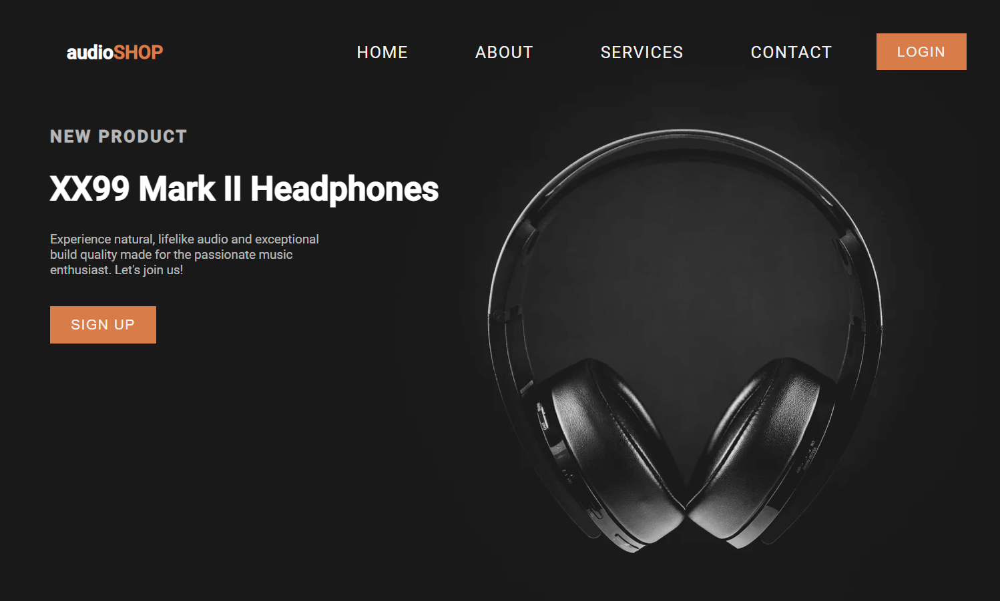
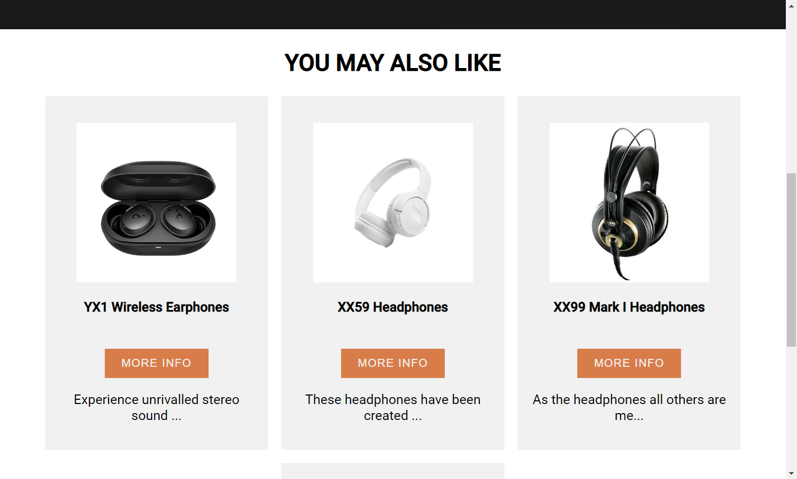
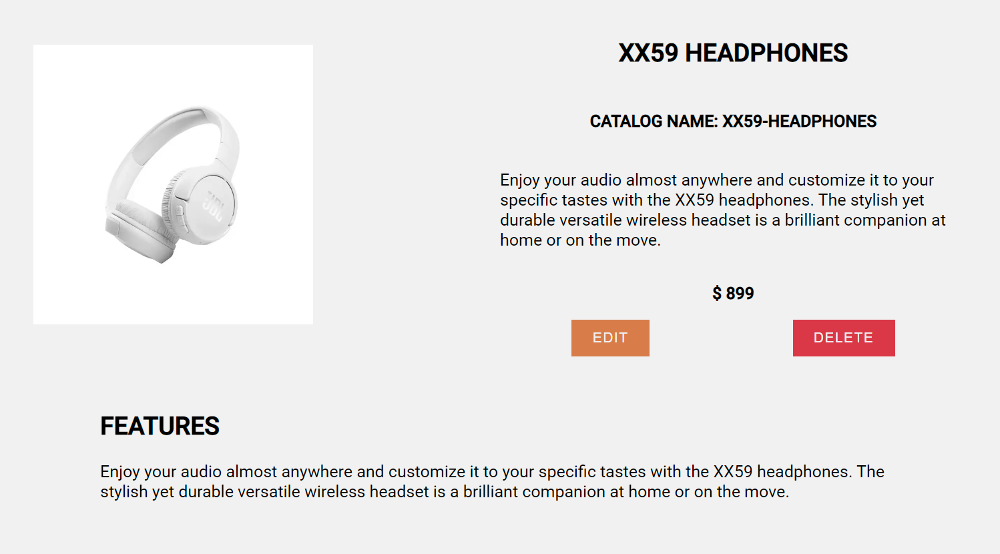

# Aplikacja E-commerce AudioShop

Prosta aplikacja e-commerce stworzona przy użyciu MEAN stack (MongoDB, Express.js, Angular, Node.js). Aplikacja umożliwia zarządzanie produktami i oferuje podstawowe operacje CRUD (Create, Read, Update, Delete).

## Funkcje

- Przeglądanie listy produktów
- Dodawanie nowych produktów
- Edycja istniejących produktów
- Usuwanie produktów

## Technologie

Aplikacja została zbudowana przy użyciu następujących technologii:

- MongoDB - baza danych NoSQL, używana do przechowywania informacji o produktach
- Express.js - framework Node.js, używany do tworzenia RESTful API dla aplikacji
- Angular - framework JavaScript, używany do budowy interfejsu użytkownika aplikacji
- Node.js - środowisko wykonawcze JavaScript po stronie serwera

